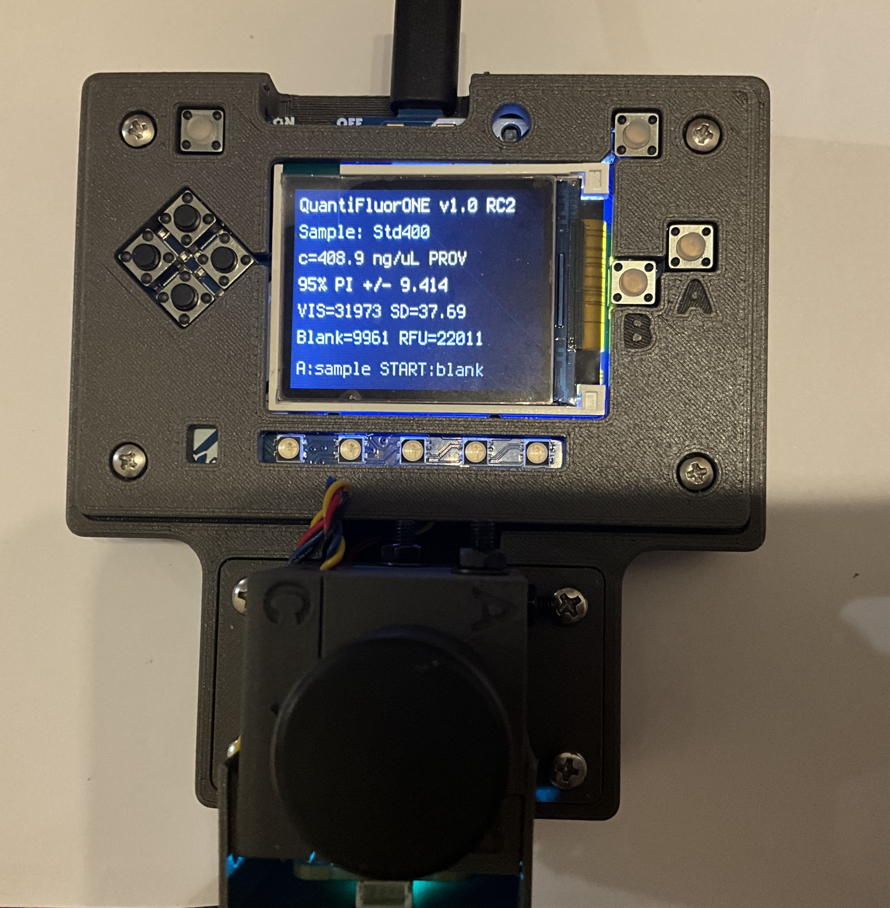
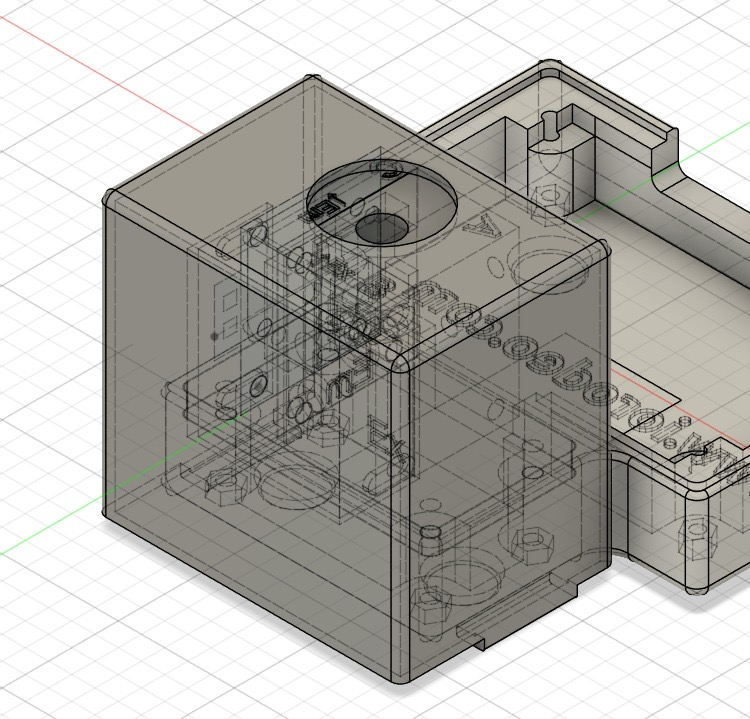
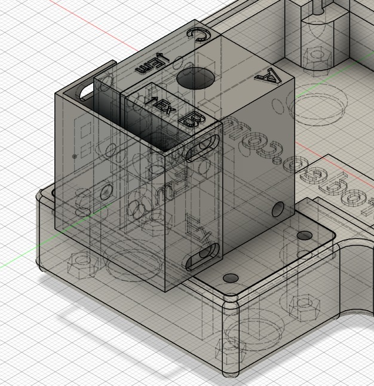
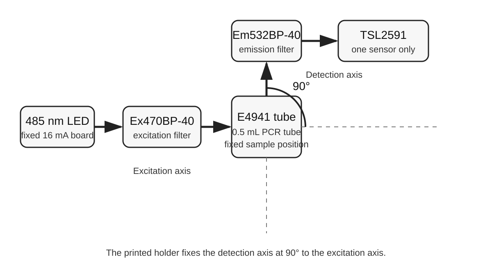
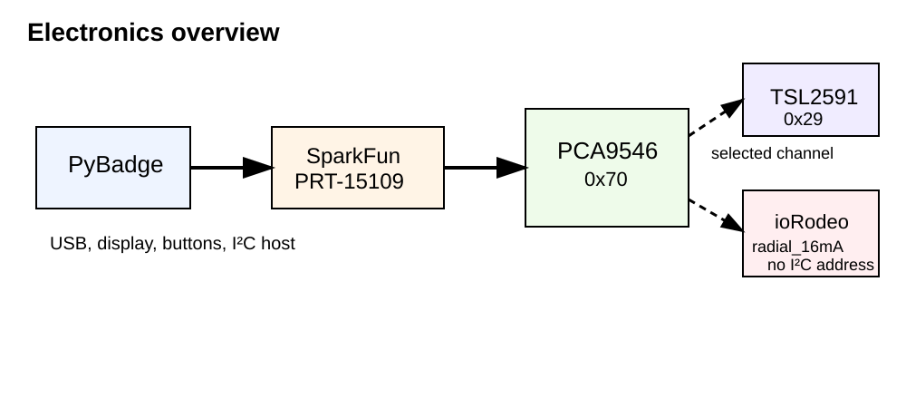

# DIY-QuantiFluorONE-dsDNA-Fluorometer — Hardware and Assembly

> **Document status:** workshop draft with confirmed core hardware. The assembled-instrument photograph, PyBadge enclosure STEP files, PyBadge PCB sources, and ioRodeo LED-board manufacturing files are included. The final 0.5 mL PCR-tube optical-holder files, separate light-shield files, exact PCA9546 channel map, cable lengths, and detailed internal photographs are still pending.

## 1. Purpose and workshop outcome

This chapter guides participants through the identification, assembly, inspection, and first hardware check of the DIY-QuantiFluorONE-dsDNA-Fluorometer. It is intended as a practical build guide rather than a comprehensive electronics or fluorescence textbook.

At the end of the workshop, the participant should be able to:

- identify every electronic, optical, and mechanical component;
- install the 485 nm excitation source and both optical filters;
- install the Promega E4941 tube holder and the single TSL2591 sensor;
- confirm that the detection axis is fixed at 90° to the excitation axis;
- connect the PyBadge, PCA9546 multiplexer, TSL2591, and fixed-current LED board;
- perform a pre-power inspection and a first hardware test;
- locate the source, CAD, PCB, Gerber, and assembly files needed to reproduce the instrument.

The instrument uses **one TSL2591 sensor only**. It does not use a second reference or transmission sensor.

## 2. Complete component overview and bill of materials

The machine-readable bill of materials is stored in `bom/master_bom.csv`. The core configuration is summarized below.

| Group | Component | Confirmed configuration | Quantity |
|---|---|---|---:|
| Controller | Adafruit PyBadge | Product ID 4200 | 1 |
| I²C distribution | Adafruit PCA9546 multiplexer | Product ID 5664; address `0x70` | 1 |
| Detector | Adafruit TSL2591 STEMMA QT | Product ID 1980; address `0x29` | 1 |
| LED driver | ioRodeo fixed-current radial LED board | `radial_16mA`, `ver_0p1_rev_3` | 1 |
| Excitation source | 5 mm Ice Blue/Cyan radial LED | 485 nm; 30°; 12,000 mcd; 3.2 V; article 1030055 | 1 |
| Excitation filter | Neemoo Ex470BP-40 | **8 x 8 x 1 mm**, installed | 1 |
| Emission filter | Neemoo Em532BP-40 | **8 x 8 x 1 mm**, installed | 1 |
| Sample vessel | Promega E4941 thin-walled 0.5 mL PCR tube | workshop sample tube | as required |
| Cabling | STEMMA QT / Qwiic JST SH four-pin cables | final lengths pending | as required |
| Adapter | SparkFun Qwiic-to-Grove adapter cable | PRT-15109 | 1 |
| Mechanical assembly | 3D-printed PyBadge enclosure | STEP files included | 1 set |
| Optical assembly | 3D-printed tube and optics holder | final files pending | 1 |
| Light control | 3D-printed light shield | final files pending | 1 |
| Programming and power | USB Micro cable | programming, power, and charging | 1 |
| Portable power | 3.7 V LiPo battery | 400 mAh; status optional until confirmed | 0 or 1 |

The confirmed mounting fasteners are:

- four M2.5 x 20 screws with matching M2.5 nuts for fastening the PyBadge cover to the enclosure;
- four M3 x 20 screws with matching M3 nuts for fastening the PCR-tube holder to the enclosure.

Cable clips and the final filter-retention details remain listed in `bom/assembly_hardware_tbd.csv` until the optical-holder archive is added.

## 3. Function of the components

### 3.1 Electronic components

**Adafruit PyBadge.** The PyBadge is the controller and user interface. It provides the display, buttons, reset switch, on/off switch, USB Micro connection, LiPo connector, battery charging circuit, and the I²C interface used by the external modules. The documented software baseline for this project is CircuitPython 9.1.1.

**PCA9546 multiplexer.** The multiplexer divides the upstream I²C connection into four selectable downstream branches. Its address is `0x70`. The final channel allocation must be copied from the assembled instrument and entered in `hardware/wiring/qfo_cable_map.csv` before the hardware release is tagged.

**TSL2591 sensor.** The TSL2591 detects light passing through the emission filter. Its address is `0x29`. Only one TSL2591 is installed, and its detection axis is mechanically fixed at 90° to the excitation axis.

**ioRodeo fixed-current LED board.** Revision `ver_0p1_rev_3` supplies a fixed nominal LED current of 16 mA. It is not an addressable I²C device. Its SDA and SCL conductors are pass-through connections, so the board must not be expected to appear in an I²C scan.

### 3.2 Optical components

**485 nm LED.** The LED provides excitation light. Its radial package must be installed with the correct polarity and must be seated without bending the leads against the printed holder.

**Ex470BP-40 excitation filter.** This **8 x 8 x 1 mm** filter is positioned between the LED and sample tube. It limits the excitation spectrum before the light reaches the sample.

**Em532BP-40 emission filter.** This **8 x 8 x 1 mm** filter is positioned between the sample tube and TSL2591. It reduces direct excitation light and passes the fluorescence region used by the detector.

**Promega E4941 tube.** The thin-walled 0.5 mL PCR tube defines the sample container used by the mechanical holder. The tube must reach the mechanical stop reproducibly and must not be forced into the holder.

### 3.3 Mechanical components

The printed parts perform four critical tasks:

1. locate the sample tube at a reproducible depth;
2. align the LED and excitation filter with the excitation axis;
3. align the emission filter and active TSL2591 area with the detection axis;
4. shield the optical path from room light and display light.

The holder establishes the 90° geometry mechanically. The correct wording is therefore **“at 90°”**, not “approximately at 90°”.

## 4. Preparation and inspection of the 3D-printed parts

Before installing electronics or filters:

1. Compare every printed part with the CAD screenshots and file names.
2. Remove support material completely from tube, LED, filter, sensor, screw, and cable openings.
3. Check that no loose strands, curled edges, or partially detached layers can enter the optical path.
4. Inspect the tube bore for ridges that could scratch or jam an E4941 tube.
5. Insert an empty tube gently and confirm that it reaches the stop without excessive force.
6. Check the filter pockets with a clean **8 x 8 x 1 mm** test piece where possible.
7. Check that the LED board and TSL2591 can be inserted without bending the PCBs.
8. Hold the empty printed assembly against a bright lamp and mark any visible light leaks.
9. Clean all printed debris before bringing the optical filters near the holder.

Do not enlarge filter pockets with a power tool while the filters or electronics are installed. Fine manual correction is safer and easier to control.

## 5. Installation of the LED and excitation filter

1. Disconnect USB and remove the LiPo battery if fitted.
2. Identify the LED anode and cathode from the component data and PCB markings.
3. Insert the 5 mm 485 nm LED into the ioRodeo radial LED board in the documented polarity.
4. Confirm that the LED body is straight and that its optical axis points through the excitation opening.
5. Solder only after checking orientation. Avoid prolonged heating of the LED leads.
6. Trim leads so that they cannot touch the enclosure or another conductor.
7. Handle the **8 x 8 x 1 mm** Ex470BP-40 by its edges. Do not touch the clear aperture.
8. Insert the filter into the excitation-filter pocket without twisting or forcing it.
9. Confirm that the filter fully covers the optical opening and cannot rattle into the tube chamber.
10. Install the intended clip, cover, or retention part. The final retention method is to be documented when the optical-holder archive is supplied.

> **Check:** Looking from the LED side, the sequence must be LED → Ex470BP-40 → sample tube.

## 6. Installation of the Promega E4941 sample-tube holder

The final holder archive is pending. The assembly procedure will be finalized from the supplied STEP/STL files. The following checks already apply:

1. The E4941 tube must enter vertically and reach a defined mechanical stop.
2. The tube must not tilt toward either optical opening.
3. The tube wall must not touch the LED or sensor board.
4. The optical interrogation region must remain at the same height for every tube.
5. The tube must be removable without pulling the optical module or cables.
6. The holder must block stray light around the upper tube opening when the light shield is installed.

## 7. Installation of the emission filter and single TSL2591 sensor

1. Handle the **8 x 8 x 1 mm** Em532BP-40 only by its edges.
2. Insert it into the detection-side filter pocket.
3. Confirm that it fully covers the detection opening.
4. Identify the active optical area of the TSL2591 board.
5. Orient the board so that the active area faces the emission filter directly.
6. Seat the board flat against its locating surfaces.
7. Fasten it without bowing the PCB.
8. Route the Qwiic cable away from the sample tube and optical openings.
9. Confirm once more that only one TSL2591 is present.

> **Check:** Looking from the detector side, the sequence must be sample tube → Em532BP-40 → TSL2591.

## 8. Correct 90° optical geometry

The excitation axis passes from the LED through the Ex470BP-40 to the sample. The detection axis passes from the sample through the Em532BP-40 to the single TSL2591. The printed holder fixes these axes at 90°.

The workshop inspection is mechanical and visual:

- the LED aperture must point to the tube centerline;
- the detector aperture must point to the same tube region;
- the two axes must be orthogonal in the CAD and printed locating features;
- the tube must reach the designed stop;
- neither filter may be tilted, displaced, or partly outside its aperture;
- the TSL2591 active area must face the emission-filter opening.

Do not compensate for poor printed fit by angling the sensor board or LED. Correct the printed part or replace it.

## 9. Installation of the PyBadge, multiplexer, and LED board

1. Place the PyBadge in the enclosure without connecting a battery.
2. Confirm access to the reset button, on/off switch, USB Micro port, and LiPo connector.
3. Fit the cover and check that no button is held down by the printed part.
4. Install the PCA9546 in its intended mounting position.
5. Install the ioRodeo `radial_16mA` board near the optical module without allowing its solder joints to touch the enclosure hardware.
6. Ensure that the LED board revision is `ver_0p1_rev_3`.
7. Keep all boards mechanically supported. Qwiic cables must not be used as structural restraints.
8. Leave enough service loop to disconnect a board without pulling directly on the wire bundle.

## 10. STEMMA QT / Qwiic wiring and I²C addresses

The confirmed address map is:

| Device | Address | Expected in I²C scan? |
|---|---:|---|
| PCA9546 multiplexer | `0x70` | yes, on the upstream bus |
| TSL2591 | `0x29` | yes, on its selected downstream channel |
| ioRodeo fixed 16 mA LED board | none | no |

The intended upstream connection is:

`PyBadge I²C connector → SparkFun PRT-15109 → PCA9546 upstream connector`

The exact downstream PCA9546 channel assignment, cable order, and cable lengths remain to be transcribed from the final instrument. They are deliberately marked `TBD` in the cable map rather than guessed.

When inserting JST-SH connectors:

- hold the plug, not the cable;
- check alignment before applying pressure;
- do not lever the socket from the PCB;
- do not connect or disconnect while the instrument is powered;
- verify that no cable crosses the tube opening or blocks a filter aperture.

## 11. Cable routing, strain relief, and prevention of light leakage

1. Route cables along enclosure walls and printed channels.
2. Keep the optical chamber clear of wire loops.
3. Provide a service loop near each detachable board.
4. Add strain relief close to the PyBadge adapter and optical module, not directly at the JST-SH socket.
5. Avoid sharp folds in Qwiic cables.
6. Keep cables clear of the reset button, power switch, and USB connector.
7. Close unused optical and cable openings with the intended printed cover or opaque material.
8. Inspect the closed enclosure in a dark room while illuminating its exterior from several directions.
9. Pay particular attention to the tube opening, filter pockets, cable pass-throughs, display edge, and the joint between the optical module and base.

The final light shield must be fitted before blank stability and low-signal performance are evaluated.

## 12. Recommended step-by-step assembly sequence

1. Print and inspect all mechanical parts.
2. Test the E4941 tube fit using an empty tube.
3. Test filter-pocket fit using a **8 x 8 x 1 mm** test piece without touching the optical apertures.
4. Install the 485 nm LED on the ioRodeo revision-3 board.
5. Install the Ex470BP-40 excitation filter.
6. Install the E4941 sample-tube holder.
7. Install the Em532BP-40 emission filter.
8. Install the single TSL2591 with its active area facing the filter.
9. Mount the optical module on the instrument base.
10. Mount the PyBadge in its enclosure.
11. Mount the PCA9546 and LED board.
12. Connect the upstream adapter and downstream Qwiic cables according to the final cable map.
13. Route cables and add strain relief.
14. Fit the light shield.
15. Perform the pre-power inspection.
16. Carry out first power-up using USB before adding an optional LiPo battery.
17. Record the actual channel map, cable lengths, and any assembly deviations.

## 13. Pre-power inspection

Do not power the instrument until every item below is checked.

- [ ] PyBadge is switched off.
- [ ] USB is disconnected.
- [ ] LiPo battery is disconnected or confirmed undamaged and correctly connected.
- [ ] LED polarity is correct.
- [ ] No LED lead or solder joint contacts the enclosure hardware.
- [ ] Ex470BP-40 is installed on the LED side.
- [ ] Em532BP-40 is installed on the sensor side.
- [ ] TSL2591 active area faces the emission filter.
- [ ] Only one TSL2591 is installed.
- [ ] PCA9546 orientation and upstream connection are correct.
- [ ] All JST-SH plugs are fully seated and correctly aligned.
- [ ] No cable is pinched by the cover.
- [ ] Reset and power controls move freely.
- [ ] USB Micro connector is accessible without forcing the cable.
- [ ] Tube can be inserted and removed without contacting electronics.
- [ ] Light shield and enclosure close without pressure on the boards.
- [ ] No loose screw, wire clipping, or printed debris remains inside.

## 14. First power-up and hardware checks

Use USB power for the first check. Leave the optional LiPo disconnected.

1. Connect a known-good USB Micro data cable.
2. Switch on the PyBadge.
3. Confirm that the display starts normally.
4. Confirm that the PCA9546 is detected at `0x70`.
5. Select the configured downstream channel and confirm that the TSL2591 is detected at `0x29`.
6. Do not expect an I²C address for the fixed-current LED board.
7. Confirm that the 485 nm LED illuminates when the hardware and firmware configuration calls for it.
8. Do not look directly into the LED or the excitation aperture.
9. Place an empty E4941 tube in the holder and close the light shield.
10. Compare the sensor reading with the shield open and closed. A large room-light response indicates incomplete shielding or an uncovered optical path.
11. Insert the intended blank and check that repeated readings are stable enough for subsequent calibration work.
12. Record any channel or cable-map corrections immediately.

Firmware installation, menu operation, and analytical calibration are covered in their own chapters.

## 15. Troubleshooting

| Symptom | Likely cause | Workshop check |
|---|---|---|
| PyBadge does not start | power switch off, charge-only/failed cable, low battery, short circuit | disconnect external modules; test USB cable and switch position |
| PCA9546 not found at `0x70` | adapter orientation, loose connector, damaged cable, upstream wiring error | inspect PyBadge-to-PRT-15109-to-PCA9546 chain |
| TSL2591 not found at `0x29` | wrong channel, loose downstream cable, incorrect orientation, damaged socket | select each documented channel; inspect cable and sensor board |
| LED board not shown in scan | normal behavior | the fixed 16 mA board has no I²C address |
| LED remains dark | reversed LED, poor solder joint, no supply, damaged LED or driver board | power off; verify polarity and continuity before replacement |
| Sensor saturates | light shield open, emission filter missing, filter displaced, direct LED path | close shield and inspect filter sequence and geometry |
| Signal is unexpectedly low | LED/filter misalignment, sensor faces away, dirty filter, tube not seated | inspect optical axis, active area, tube stop, and optical surfaces |
| Blank changes with room lighting | light leak at tube opening, cable slot, enclosure seam, or display edge | dark-room flashlight inspection; refit shield and covers |
| Tube jams | support residue, undersized bore, damaged tube | remove tube; clean or reprint holder; do not force it |
| Readings change after handling | loose filter, sensor board movement, cable strain | inspect retention and strain relief; repeat mechanical check |

## 16. Cleaning, maintenance, and replacement of optical components

- Switch off and disconnect USB and LiPo before opening the instrument.
- Remove the sample tube immediately after use.
- Wipe spilled reagent before it reaches filter pockets or PCB surfaces.
- Handle filters by the edges using clean gloves or suitable tweezers.
- Use clean optical tissue or a blower intended for optical work.
- Do not use abrasive paper, cotton fibers, or aggressive solvent on filter coatings.
- Check compatibility before applying alcohol or another solvent to printed parts.
- Do not scrape the active TSL2591 area.
- Replace cracked, delaminated, deeply scratched, or chemically attacked filters.
- Recheck blank response and recalibrate after replacing the LED, either optical filter, the sample holder, or the TSL2591.
- Inspect Qwiic sockets and cables periodically for looseness or strain damage.
- Inspect the LiPo for swelling, puncture, unusual heat, or damaged leads. Remove a suspect battery from service.

## 17. Safety notes

- Do not stare directly into the 485 nm LED, especially when the excitation filter or light shield is removed.
- Disconnect power before soldering, rewiring, installing filters, or moving boards.
- Prevent metal tools and loose screws from shorting the PyBadge or LED board.
- Observe LiPo polarity. Do not use swollen, damaged, wet, or overheated batteries.
- Charge the battery only through the intended PyBadge charging circuit and a suitable USB supply.
- Keep liquids away from the open electronics.
- Follow the safety data sheets and laboratory rules for QuantiFluor ONE reagent, DNA standards, cleaning agents, and samples.
- Dispose of reagents, samples, tubes, electronics, and batteries according to local rules.

## 18. Reproducibility files and references

This package includes:

- PyBadge enclosure STEP files;
- CAD screenshots of the enclosure and optical module;
- ioRodeo `radial_16mA` revision-3 KiCad, Gerber, BOM, CPL, and position files;
- Adafruit PyBadge EagleCAD schematic and board files;
- upstream license files and source notes;
- the current assembled-instrument photograph;
- BOM, wiring, I²C, figure, and open-item manifests.

Still required for the final hardware release:

- final 0.5 mL PCR-tube optical-holder archive;
- final separate light-shield CAD/print files if not contained in that archive;
- open-instrument wiring photograph;
- excitation-side photograph showing LED and Ex470BP-40;
- detection-side photograph showing Em532BP-40 and the single TSL2591;
- confirmed PCA9546 channel allocation and cable lengths;
- final cable-retention details and LiPo status;
- print settings and printable STL/3MF files where applicable.

The third-party source locations and licenses are recorded in `THIRD_PARTY_NOTICES.md` and the `SOURCE.md` files beside the upstream hardware data.
