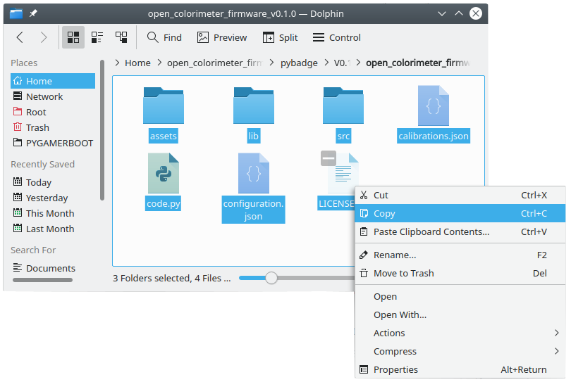

# DIY-QuantiFluorONE-dsDNA-Fluorometer — Installing CircuitPython, the Bootloader, and Firmware

> **Project software set:** CircuitPython 9.1.1, QuantiFluorONE `QF1-1.0.0-rc2`, and PyBadge UF2 bootloader updater 3.15.0.

## 1. Before starting

Use a known-good USB Micro **data** cable. Back up the complete `CIRCUITPY` drive before upgrading CircuitPython, changing firmware, or deleting data. Safely eject USB drives before resetting or disconnecting the device.

## 2. Three reset actions that must not be confused

| Reset action | Result | Drive | Use |
|---|---|---|---|
| One press | normal restart | `CIRCUITPY` | restart or leave safe mode |
| **Slow double-click** | CircuitPython safe mode | `CIRCUITPY` | copy, replace, download, or delete firmware, CSV, and JSON files |
| Fast double-click | UF2 bootloader mode | `PYBADGEBOOT` or `BADGEBOOT` | install CircuitPython or a bootloader-updater UF2 |

The slow double-click means: press Reset once, wait for startup to begin, and press it again during the approximately one-second safe-mode window. It is intentionally slower than the rapid double-click used for UF2 bootloader mode.

## 3. Bootloader mode

Connect USB, switch the device on, and fast-double-click Reset. The display changes to the PyBadge UF2 bootloader screen and the computer mounts `PYBADGEBOOT` or `BADGEBOOT`.

Open `INFO_UF2.TXT` to check the installed bootloader version.

### Bootloader 3.15.0 files in this repository

The repository contains both files needed for transparent archiving and workshop installation:

- normal drag-and-drop updater: `software/bootloader/3.15.0/update-bootloader-arcade_pybadge-v3.15.0.uf2`
- raw archive binary: `software/bootloader/3.15.0/bootloader-arcade_pybadge-v3.15.0.bin`

For the normal workshop update, copy **only** `update-bootloader-arcade_pybadge-v3.15.0.uf2` to `PYBADGEBOOT` or `BADGEBOOT`. Wait for the board to restart, re-enter UF2 bootloader mode, and verify version 3.15.0 in `INFO_UF2.TXT`. Reinstall CircuitPython 9.1.1 after updating the bootloader.

The `.bin` file is retained for open-science archiving and technical recovery. **Do not copy the `.bin` file directly to the UF2 boot drive.**

## 4. Install CircuitPython 9.1.1

The supplied image is:

`software/circuitpython/9.1.1/adafruit-circuitpython-pybadge-en_US-9.1.1.uf2`

1. Back up the current `CIRCUITPY` contents.
2. Enter UF2 bootloader mode with a **fast** double-click.
3. Copy the CircuitPython UF2 file to `PYBADGEBOOT` or `BADGEBOOT`.
4. Wait while the board restarts.
5. Confirm that the boot drive disappears and `CIRCUITPY` appears.
6. Safely eject the drive before disconnecting or power-cycling.

## 5. Enter safe mode before firmware or data-file work

For this project, use the **slow double-click** before copying firmware, replacing JSON, downloading CSV logs, or deleting old files.

Safe mode prevents the QuantiFluorONE application from running while the computer modifies the filesystem. Press Reset once after safely ejecting the drive to return to normal operation.

## 6. Install QuantiFluorONE QF1-1.0.0-rc2

The repository contains both the original supplied release and a clean device-install payload:

- original archive: `firmware/releases/archives/QuantiFluorONE_Firmware_1.0.0-rc2-stable.zip`
- extracted source package: `firmware/releases/QF1-1.0.0-rc2/source_package/`
- device installer: `firmware/device_install/QuantiFluorONE_QF1-1.0.0-rc2_CIRCUITPY.zip`

The device installer excludes generated logs, state files, desktop tests, and cache files.

### Installation steps

1. Back up the entire existing `CIRCUITPY` drive, including CSV and JSON files.
2. Enter safe mode with the **slow double-click**.
3. Open `CIRCUITPY`.
4. Delete the old firmware files after confirming the backup.
5. Unzip `QuantiFluorONE_QF1-1.0.0-rc2_CIRCUITPY.zip` on the computer.
6. Copy the **contents** of the extracted directory to the root of `CIRCUITPY`; do not copy the outer directory itself.
7. Confirm that `boot.py`, `code.py`, `quantifluorone_app.py`, `quantifluorone_config.json`, `quantifluorone_multipoint.json`, `lib/`, `src/`, and `assets/` are present.
8. Safely eject `CIRCUITPY`.
9. Press Reset once or power-cycle the instrument.
10. Confirm that the display starts with `QuantiFluorONE v1.0 RC2`.

## 7. First startup checks

1. Confirm the version on the display.
2. Confirm that the PCA9546 and the single TSL2591 initialize without an error screen.
3. Open the SELECT menu.
4. Choose `LOAD MP CAL` only when a compatible `quantifluorone_multipoint.json` is present.
5. Measure a fresh reagent blank with START.
6. Measure a test sample with A.
7. Check whether `quantifluorone_log_v100rc2.csv` is created when the instrument is disconnected from a USB data host and powered from a charger or power bank.

## 8. Troubleshooting

| Symptom | Check |
|---|---|
| No USB drive appears | verify a data-capable USB cable, switch position, USB port, and reset timing |
| `PYBADGEBOOT` appears instead of `CIRCUITPY` | the reset presses were too fast; press Reset once to restart normally |
| Firmware files cannot be changed reliably | use the slow double-click to enter safe mode first |
| Device stays in safe mode | safely eject, then press Reset once or power-cycle |
| Display shows an error | compare copied files with the device-install payload and check `lib/`, `src/constants.py`, and JSON files |
| CSV is not written while connected to a computer | expected with the project filesystem policy; disconnect the data host and use a charger or power bank for firmware-side logging |

## 9. Source guides

This chapter is adapted for QuantiFluorONE from the IO Rodeo Open Colorimeter installation guides and the Adafruit PyBadge documentation:

- IO Rodeo: `https://blog.iorodeo.com/installing-upgrading-circuitpython-or-the-bootloader/`
- IO Rodeo: `https://blog.iorodeo.com/installing-upgrading-the-firmware/`
- Adafruit: `https://learn.adafruit.com/adafruit-pybadge/installing-circuitpython`
- Adafruit: `https://learn.adafruit.com/adafruit-pybadge/updating-the-bootloader`
