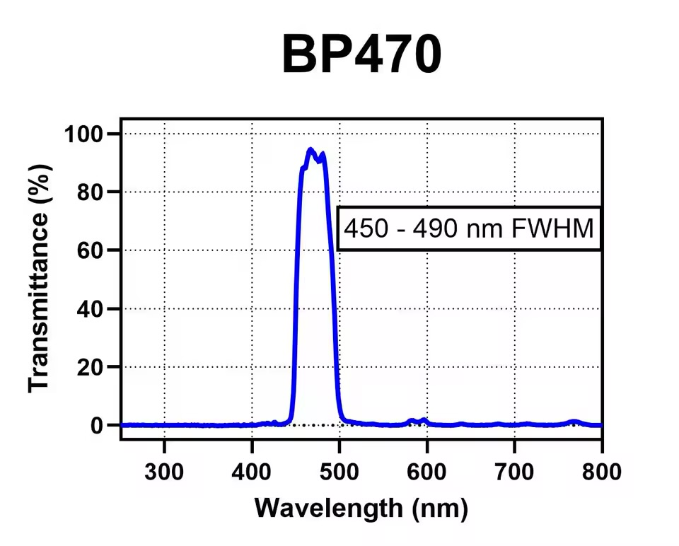
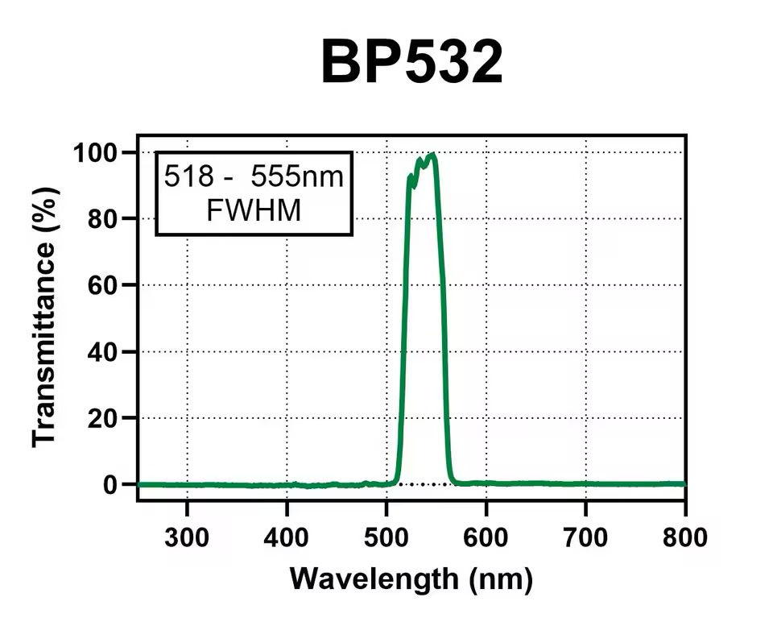

# Purpose and practical scope

This chapter provides the minimum theory needed to understand, calibrate, and use the DIY-QuantiFluorONE-dsDNA-Fluorometer in a workshop. It is not intended to be a complete textbook on fluorescence spectroscopy or analytical-method validation.

The instrument uses off-the-shelf optical and electronic components, one fluorescence sensor, a fixed 90° optical geometry, and the Promega QuantiFluor® ONE dsDNA assay. Quantitative results are obtained only after blank measurement and calibration. The current repository status and the analytical validation status must always be reported separately.

> **Workshop objective:** Prepare a reagent blank, standards, and unknown samples; measure the blank-corrected fluorescence response; apply a two-point or multipoint calibration; and interpret the result within the calibrated working range.

# Fluorescence in brief

A fluorophore absorbs excitation light and reaches an electronically excited state. Part of the absorbed energy is then emitted as fluorescence at a longer wavelength. The separation between the excitation and emission maxima is the **Stokes shift**.

For the QuantiFluor® ONE dsDNA dye, Promega specifies an excitation maximum of 504 nm and an emission maximum of 531 nm. The nominal Stokes shift is therefore about 27 nm [@promega_tm405].

Within a suitable working range, the fluorescence response increases with the amount of dye-bound dsDNA. The measured signal is also influenced by excitation intensity, filter transmission, sample-vessel geometry, dye binding, sensor settings, temperature, and sample matrix. At high concentrations, detector saturation, inner-filter effects, or dye-response nonlinearity may occur [@lakowicz2006; @valeur2012].

Important practical effects are:

- **Background:** signal from the reagent, tube, sensor, stray light, and sample matrix;
- **Quenching:** reduced fluorescence caused by molecular interactions or sample constituents;
- **Photobleaching:** signal loss caused by prolonged illumination;
- **Interference:** fluorescence or absorption from contaminants, extraction reagents, RNA, ssDNA, proteins, salts, or solvents.

These effects are controlled primarily by using a matching reagent blank, identical tubes and geometry, consistent incubation and reading times, and calibration standards prepared in a suitable matrix.

# Optical architecture

The optical path is fixed by the 3D-printed holder:

```text
485 nm nominal radial LED
        ↓
Neemoo Ex470BP-40 excitation filter
        ↓
Promega E4941 thin-walled 0.5 mL PCR tube
        ↓
QuantiFluor® ONE dye–dsDNA fluorescence
        ↓  at 90° to the excitation axis
Neemoo Em532BP-40 emission filter
        ↓
one Adafruit TSL2591 fluorescence sensor
```

The TSL2591 sensor axis is positioned **at 90°** to the excitation axis. This geometry reduces direct illumination of the sensor by the excitation beam. The geometry, tube position, filters, LED current, gain, and integration time are part of the calibration and must remain unchanged during a measurement series.

## Installed optical and electronic components

| Component | Installed configuration | Practical role |
|---|---|---|
| Excitation LED | 5 mm radial 485 nm “Ice Blue/Cyan” LED; 30°; 12,000 mcd; 3.2 V; article 1030055 | Excites the dye–dsDNA complex |
| LED control board | ioRodeo `i_control_led` I²C board, SMD0603 production version, configured for 16 mA | Provides defined LED operation through the I²C system |
| Excitation filter | Neemoo Ex470BP-40 | Selects the useful blue excitation band and reduces longer-wavelength LED emission |
| Sample vessel | Promega thin-walled 0.5 mL PCR tube, Cat. No. E4941 | Defines the assay volume and optical geometry |
| Emission filter | Neemoo Em532BP-40 | Passes the green fluorescence band and suppresses excitation light |
| Sensor | Adafruit TSL2591 High Dynamic Range Digital Light Sensor, Product ID 1980, I²C address `0x29` | Measures the filtered fluorescence signal |
| Multiplexer | Adafruit PCA9546 four-channel STEMMA QT/Qwiic I²C multiplexer, project inventory Product ID 5664, address `0x70` | Selects the connected I²C channels |
| Controller | Adafruit PyBadge, Product ID 4200 | Runs the CircuitPython firmware and displays and stores results |
| Cabling | STEMMA QT/Qwiic JST SH four-pin cables and SparkFun PRT-15109 Qwiic–Grove adapter | Connects the PyBadge, multiplexer, LED board, and sensor |

The PyBadge-based firmware and hardware arrangement build on the open ioRodeo Open Colorimeter Plus ecosystem [@iorodeo_ocp_firmware; @iorodeo_led_board]. Component identities and connections are documented by the corresponding Adafruit and SparkFun sources [@adafruit_tsl2591; @adafruit_pca9546; @adafruit_pybadge; @sparkfun_prt15109].

## Filter verification

The supplier provides the nominal filter designation and percentage-transmittance information [@neemoo_filters]. The actual installed filter specimens were additionally checked with the project’s DIY spectrometer based on Leslie Wright’s PySpectrometer2 project [@wright_pyspectrometer2].

The project measurements were normalized to the maximum of each curve and were used to verify the passband position and shape:

- Ex470BP-40: approximate half-maximum interval 450–490 nm;
- Em532BP-40: approximate half-maximum interval 518–555 nm.

The measurements confirm the intended spectral separation but are not used as an absolute calibration of filter transmittance.

{#fig-ex470 width=85%}

{#fig-em532 width=85%}

# Signal formation and blank correction

The TSL2591 provides a full-spectrum channel and an infrared channel. The firmware calculates a project-defined visible signal for each reading:

$$
VIS_i = \max(FULL_i - IR_i, 0)
$$

One measurement cycle consists of three technical sensor readings. Their mean is used as the cycle result:

$$
\overline{VIS}=\frac{1}{3}\sum_{i=1}^{3}VIS_i
$$

The reagent blank contains the QuantiFluor® ONE reagent but no added dsDNA. The blank-corrected response is:

$$
RFU=\overline{VIS}_{sample}-\overline{VIS}_{blank}
$$

RFU means **relative fluorescence unit**. It is an instrument-dependent response, not an SI unit. Signed RFU values are retained in the raw data. A negative value indicates that the measured sample response was below the stored blank response; it must not be interpreted as a negative physical DNA concentration.

A new blank should be measured when the reagent lot, tube type, optical arrangement, sensor settings, temperature conditions, or measurement session changes.

# dsDNA quantification with QuantiFluor® ONE

The QuantiFluor® ONE dsDNA System is an add-and-read fluorescent assay for purified dsDNA. Promega specifies 504 nm excitation, 531 nm emission, and a nominal range of 0.2–400 ng dsDNA input. The kit includes QuantiFluor® ONE Lambda DNA at 400 µg/mL as a calibration material [@promega_tm405].

The project uses:

```text
1 µL sample or standard + 200 µL QuantiFluor® ONE reagent
= 201 µL physical total volume
```

Promega recommends thin-walled 0.5 mL PCR tubes, thorough mixing without bubbles, five minutes of incubation at room temperature protected from light, and careful pipetting of the small sample volume [@promega_tm405].

## λ-DNA standards

λ-DNA is double-stranded DNA from bacteriophage lambda and is suitable for preparing calibration standards. Record the supplier, product, lot, stock concentration, dilution medium, preparation date, and storage conditions. Use fresh low-concentration dilutions where practical, and mix carefully without introducing bubbles.

Promega notes that a standard with a molecular size similar to the unknown DNA may improve comparability. Therefore λ-DNA is a practical workshop standard, but matrix and fragment-size differences remain possible sources of bias [@promega_tm405].

# Calibration

Calibration links the blank-corrected fluorescence response to an assigned dsDNA concentration or DNA mass. The linear model used by the project is:

$$
y=a+bx
$$

where $y$ is RFU, $x$ is the selected concentration or mass basis, $a$ is the intercept, and $b$ is the slope. For an unknown sample:

$$
\hat{x}=\frac{y-a}{b}
$$

The calibration basis and unit must be stored with the calibration. The firmware normally reports the original-sample concentration in ng/µL and also records the corresponding in-assay concentration.

## Two-point calibration

The two-point workflow uses a reagent blank and one known standard. After blank correction, the working intercept is zero:

$$
b=\frac{RFU_{standard}}{x_{standard}}
$$

$$
x_{sample}=\frac{RFU_{sample}}{b}
$$

Two-point calibration is fast and suitable for a workshop routine when the assay response is known to be linear in the selected range. It does not by itself test linearity or provide a residual-based assessment across the range.

## Multipoint calibration

Multipoint calibration uses several concentration levels and replicate measurements. Calibration Suite 7.2 Stable can calculate ordinary least squares (OLS) and compare it with weighted models (`1/c`, `1/c²`, and `1/s²`). It also displays residuals, confidence bands, prediction bands, recovery, and model-comparison statistics.

The current PyBadge firmware imports accepted OLS calibration data. Model selection and diagnostics are performed in Calibration Suite 7.2 Stable before the calibration JSON is transferred to the instrument.

DIN 38402-51:2017-05 is used as a reference for linear calibration concepts. The repository cites the standard but does not reproduce protected standard text [@din38402_51].

> **Practical rule:** Do not report a sample quantitatively outside the calibrated range. Dilute or re-prepare the sample and measure it again.

# LOD and LOQ

The limit of detection (LOD) and limit of quantification (LOQ) depend on the selected procedure, calibration, blank variability, and dataset. They are not fixed properties of the dye or sensor alone.

## Two-point firmware estimate

For an active two-point calibration, the firmware can measure ten independently prepared reagent blanks. Each blank is measured as one complete three-reading cycle. The sample standard deviation of the ten blank-cycle means is used:

$$
LOD_{estimate}=\frac{3s_{blank}}{b}
$$

$$
LOQ_{estimate}=\frac{10s_{blank}}{b}
$$

These are transparent blank-based estimates for workshop and instrument evaluation. They are not presented as a complete implementation of every procedure in DIN 32645.

## Multipoint calculation in Calibration Suite 7.2 Stable

For multipoint calibration, Calibration Suite 7.2 Stable implements the indirect calibration-curve calculation documented in the software as the DIN 32645 method summarized in CLB1. The calculation uses the residual standard deviation, slope, Student-$t$ factors, calibration design, significance level, the selected quantification factor $k$, and the number of future determinations. The LOQ is solved iteratively.

DIN 32645:2008-11 is cited as the relevant standard for decision, detection, and quantification limits under repeatability conditions [@din32645]. A formal claim of conformity requires a documented comparison of the software implementation with the licensed standard and the defined validation protocol.

Always report LOD and LOQ together with the calibration ID, method, unit, significance level, $k$ factor, number of calibration levels and replicates, and software version.

# Reference projects and commercial comparison

| System | Relevant role in this project | Main distinction |
|---|---|---|
| ioRodeo Open Colorimeter Plus | Open hardware and CircuitPython reference platform | General open optical-instrument platform used as a technical base |
| DIYNAFLUOR | Open-source reference for an inexpensive 90° TSL2591 nucleic-acid fluorometer | Developed primarily for Qubit assays; uses two-point calibration and off-the-shelf components |
| DIY-QuantiFluorONE | Workshop instrument described here | QuantiFluor® ONE assay, Ex470BP-40, Em532BP-40, one TSL2591 at 90°, two-point and imported multipoint calibration |
| Promega Quantus™ | Commercial reference instrument | Blue excitation peak 470 nm, blue emission band 510–580 nm, solid-state detector, and manufacturer-defined calibration workflow |

DIYNAFLUOR demonstrates that a practical nucleic-acid fluorometer can be constructed from readily available parts, a 3D-printed optical head, a 90° optical path, and a TSL2591 sensor [@anderson_diynafluor; @traulab_diynafluor]. The DIY-QuantiFluorONE design follows the same practical open-hardware philosophy but uses a different controller, LED board, filter set, assay, and calibration workflow.

Promega specifies the Quantus™ blue channel with a 470 nm excitation peak, excitation wavelengths up to 495 nm, and an emission range of 510–580 nm [@promega_tm396]. These ranges are compatible with the QuantiFluor® ONE assay and provide a useful commercial reference. Direct statements about bias, precision, or agreement require measurements of the same standards on both instruments.

# Practical validity conditions and limitations

A calibration remains valid only while the measurement configuration remains unchanged. Recalibrate or verify the calibration after changing any of the following:

- LED, LED current, excitation filter, or emission filter;
- tube type, holder, insertion depth, or optical alignment;
- TSL2591 gain, integration time, sensor board, or multiplexer channel;
- reagent formulation or lot;
- sample and reagent volumes;
- concentration basis or blank preparation.

During workshop measurements:

1. Use the same tube type for blank, standards, and unknowns.
2. Keep tube orientation and insertion depth consistent.
3. Avoid bubbles, droplets above the liquid level, fingerprints, and scratches.
4. Mix and incubate all tubes consistently and protect them from light.
5. Measure a reagent blank before samples.
6. Use standards that bracket the expected sample concentration.
7. Repeat or dilute samples outside the calibrated range.
8. Retain raw FULL, IR, VIS, blank, RFU, calibration ID, and result data.

The method is intended for research, teaching, and workshop use. It is not a clinical diagnostic method. The supplier’s nominal assay range is not automatically the validated working range of the assembled DIY instrument.

# Workshop take-away

The practical measurement chain is:

```text
Prepare blank and standards
→ incubate consistently
→ measure one TSL2591 at 90°
→ calculate VIS and blank-corrected RFU
→ apply the selected calibration
→ check range, LOD/LOQ, and validity conditions
→ save the raw and calculated data
```

# References {.unnumbered}

::: {#refs}
:::
