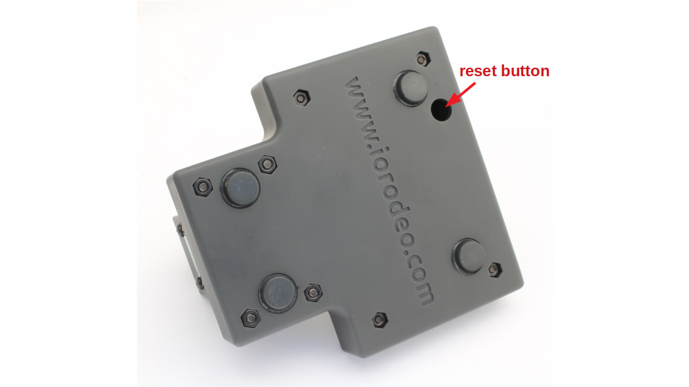
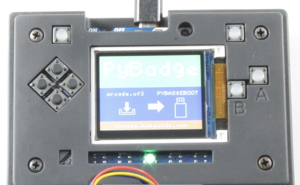
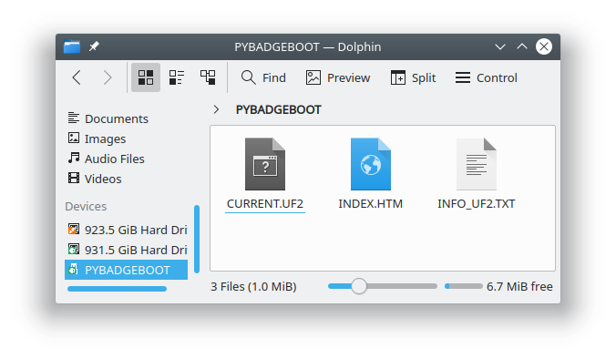
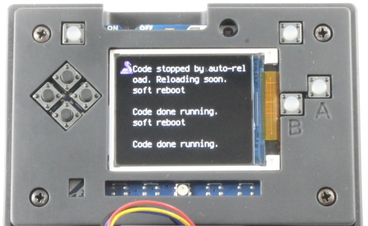

> **Current supported software set:** PyBadge UF2 bootloader 3.15.0, Adafruit CircuitPython 9.1.1, and the unchanged `QuantiFluorONE_Firmware_1.0.0-rc2-stable.zip` release.
>
> **Repository policy:** one instrument, one supported QuantiFluorONE firmware release, and one documented installation procedure.

## 1. Purpose and scope

This chapter describes the workshop procedure for preparing an Adafruit PyBadge and installing the current QuantiFluorONE firmware. It covers:

- backing up an existing `CIRCUITPY` drive;
- distinguishing normal restart, CircuitPython safe mode, and UF2 bootloader mode;
- checking or updating the PyBadge bootloader;
- installing CircuitPython 9.1.1;
- performing a clean installation of the complete stable RC2 release;
- carrying out the first startup and basic file-system checks.

The physical reset button is mounted on the **underside of the PyBadge**. It is reached from below through the dedicated reset access opening in the enclosure.

## 2. Software files in the repository

All installation components are stored under one top-level directory:

```text
software/
├── README.md
├── bootloader/
│   └── 3.15.0/
│       ├── update-bootloader-arcade_pybadge-v3.15.0.uf2
│       ├── bootloader-arcade_pybadge-v3.15.0.bin
│       └── README.md
├── circuitpython/
│   └── 9.1.1/
│       ├── adafruit-circuitpython-pybadge-en_US-9.1.1.uf2
│       └── README.md
└── quantifluorone_firmware/
    ├── QuantiFluorONE_Firmware_1.0.0-rc2-stable.zip
    ├── README.md
    └── SHA256SUMS.txt
```

The former top-level `firmware/` directory is obsolete and must not be retained after this restructuring.

| Component | Repository file | When required |
|---|---|---|
| PyBadge bootloader updater | `software/bootloader/3.15.0/update-bootloader-arcade_pybadge-v3.15.0.uf2` | only when the bootloader must be updated |
| Raw bootloader image | `software/bootloader/3.15.0/bootloader-arcade_pybadge-v3.15.0.bin` | archive and technical recovery only |
| CircuitPython | `software/circuitpython/9.1.1/adafruit-circuitpython-pybadge-en_US-9.1.1.uf2` | after a bootloader update or for a clean CircuitPython installation |
| Current device firmware | `software/quantifluorone_firmware/QuantiFluorONE_Firmware_1.0.0-rc2-stable.zip` | clean QuantiFluorONE installation |

Use a computer with a USB port and a known-good USB Micro **data cable**. A charge-only cable cannot expose the PyBadge drives.

Use a short **non-conductive** tool to reach the reset switch through the underside opening. The eraser end of a pencil or a suitable plastic rod is preferable to a metal tool.



## 3. One supported QuantiFluorONE firmware

The current supported device firmware is the unchanged archive:

```text
software/quantifluorone_firmware/
QuantiFluorONE_Firmware_1.0.0-rc2-stable.zip
```

Do not shorten, clean, rename, rebuild, or replace this archive with a reduced derivative. The ZIP file is the preserved software state that was tested on the instrument.

Earlier development versions remain traceable through Git history, tags, or GitHub releases, but they are not presented in the main repository as competing installation choices.

> **Important:** “stable RC2” describes the tested firmware package and operating workflow. The included multipoint calibration remains marked `PROVISIONAL` and is not a completed analytical-method validation.

The original archive also contains documentation that describes an earlier selective overlay procedure. Those files remain unchanged as part of the release record. For the current workshop build, follow the clean full-copy procedure in this chapter.

## 4. Back up the current device

> **Back up the complete `CIRCUITPY` drive before continuing.** Deleting its contents also removes measurement logs, calibration files, configuration files, saved blank and state files, and other user-generated data stored on the device.

1. Connect the instrument using a USB data cable.
2. Switch the PyBadge on.
3. Open the `CIRCUITPY` drive if it appears.
4. Copy its complete contents to a dated backup folder on the computer.
5. Confirm that the backup includes all CSV and JSON files that must be retained.
6. Safely eject `CIRCUITPY` before resetting, disconnecting, or power-cycling the instrument.

Do not copy old configuration, state, calibration, or log files back to the device automatically after installation. Restore only files that are known to be compatible with the current firmware.

## 5. Reset timing: three different results

| Reset action | Result | Drive | Main use |
|---|---|---|---|
| One press | normal restart | `CIRCUITPY` | restart the application or leave safe mode |
| **Slow double-click** | CircuitPython safe mode | `CIRCUITPY` | copy, replace, download, or delete firmware, CSV, and JSON files |
| Fast double-click | UF2 bootloader mode | `PYBADGEBOOT` or `BADGEBOOT` | install a bootloader-updater or CircuitPython UF2 file |

### 5.1 Slow double-click: required for file maintenance

Use the **slow double-click** before modifying files on `CIRCUITPY`:

1. Press the underside reset button once through the access opening.
2. Allow the startup sequence to begin.
3. Press Reset again during the approximately one-second safe-mode window.

Safe mode prevents the QuantiFluorONE application from running while files are changed. Automatic reload is disabled, making this the preferred state for copying firmware, replacing JSON files, downloading CSV logs, and deleting old files.

### 5.2 Fast double-click: UF2 bootloader mode

Press the underside reset button twice in quick succession. The PyBadge display changes to the UF2 bootloader screen, and the computer mounts `PYBADGEBOOT` or `BADGEBOOT`.





If `PYBADGEBOOT` appears when `CIRCUITPY` was intended, press Reset once to restart normally and repeat with slower timing.

## 6. Check or update the UF2 bootloader

A bootloader update is not required for every firmware installation.

1. Enter UF2 bootloader mode with a fast double-click.
2. Open `INFO_UF2.TXT` on `PYBADGEBOOT` or `BADGEBOOT`.
3. Read the installed bootloader version.

To install the supplied version 3.15.0 updater:

1. Copy `update-bootloader-arcade_pybadge-v3.15.0.uf2` to the UF2 boot drive.
2. Wait while the updater runs and the boot drive reappears.
3. Open `INFO_UF2.TXT` again and verify version 3.15.0.
4. Install CircuitPython 9.1.1 as described in the next section.

> **Do not copy** `bootloader-arcade_pybadge-v3.15.0.bin` to `PYBADGEBOOT` or `BADGEBOOT`. The BIN file is retained only for archival and technical recovery purposes.

## 7. Install CircuitPython 9.1.1

1. Confirm that the current `CIRCUITPY` contents have been backed up.
2. Enter UF2 bootloader mode with a **fast double-click**.
3. Copy `adafruit-circuitpython-pybadge-en_US-9.1.1.uf2` to `PYBADGEBOOT` or `BADGEBOOT`.
4. Wait for the board to restart automatically.
5. Confirm that the UF2 boot drive disappears and a new drive named `CIRCUITPY` appears.
6. Safely eject `CIRCUITPY` before disconnecting or restarting the instrument.

The stable RC2 archive records the tested runtime in `boot_out.txt` as:

```text
Adafruit CircuitPython 9.1.1 on 2024-07-22
Adafruit Pybadge with samd51j19
Board ID: pybadge
```

## 8. Clean installation of QuantiFluorONE stable RC2

This is the current recommended workshop procedure.

### 8.1 Prepare the firmware folder

1. Locate:

   ```text
   software/quantifluorone_firmware/
   QuantiFluorONE_Firmware_1.0.0-rc2-stable.zip
   ```

2. Extract the ZIP file to a normal folder on the computer.
3. Open the extracted outer folder named:

   ```text
   QuantiFluorONE_Firmware_1.0.0-rc2-stable
   ```

4. Leave the original ZIP file unchanged in the repository.

### 8.2 Empty `CIRCUITPY`

1. Confirm once more that the complete previous drive has been backed up.
2. Enter safe mode with the **slow double-click**.
3. Open the root of `CIRCUITPY`.
4. Select all existing files and folders on `CIRCUITPY`.
5. Delete the selected contents.
6. Confirm that no old firmware, library, configuration, state, calibration, or log files remain.

### 8.3 Copy the complete stable release

1. In the extracted stable-release folder, select **all files and folders inside** `QuantiFluorONE_Firmware_1.0.0-rc2-stable`.
2. Copy the complete selected contents to the **root of the empty `CIRCUITPY` drive**.
3. Do **not** copy the enclosing `QuantiFluorONE_Firmware_1.0.0-rc2-stable` folder itself. Files such as `boot.py` and `code.py` must be located directly in the root of `CIRCUITPY`.
4. Wait until copying is completely finished.
5. Compare the top-level files and folders with the extracted release folder.
6. Safely eject `CIRCUITPY`.
7. Press Reset once or power-cycle the device for a normal restart.

This full-copy procedure installs one complete, internally consistent release and avoids mixing files from different firmware generations.

## 9. First startup and hardware check

After the normal restart:

1. Confirm that the splash screen appears.
2. Confirm the display banner:

   ```text
   QuantiFluorONE v1.0 RC2
   ```

3. Confirm that no startup error screen is shown.
4. Open the SELECT menu.
5. Choose `LOAD MP CAL` only when the supplied or a compatible `quantifluorone_multipoint.json` is present.
6. Measure a fresh reagent blank with START.
7. Measure a test sample with A.

The display may show `cal=none c=uncalibrated` until a calibration is loaded or created. When the supplied provisional calibration is loaded, the status is marked `PROV`.

## 10. CSV and JSON write behaviour

The included `boot.py` provides two different file-system modes:

- with a USB data host connected, `CIRCUITPY` remains writable by the computer and read-only to the firmware;
- with a charger, power bank, or approved LiPo supply, the firmware can save blank state, calibration state, and CSV rows.

For firmware-generated writes:

1. safely eject and disconnect the USB data host;
2. power the PyBadge from a USB charger, power bank, or the approved LiPo supply;
3. restart the instrument normally;
4. perform the measurement or save operation.

Use the **slow double-click** whenever returning to computer-based file maintenance.

## 11. Updating or reinstalling the same supported release

Use the same clean procedure whenever a complete reinstall is needed:

1. back up `CIRCUITPY`;
2. enter safe mode with the slow double-click;
3. delete the complete contents of `CIRCUITPY`;
4. extract the unchanged stable RC2 archive;
5. copy all contents inside the extracted release folder to the root of `CIRCUITPY`;
6. safely eject and restart;
7. verify the RC2 display banner.

Do not merge a new installation with residual files from an older device state.

## 12. Troubleshooting

| Symptom | Likely cause or corrective action |
|---|---|
| No USB drive appears | check the power switch, USB port, and use a known data-capable cable |
| `PYBADGEBOOT` appears instead of `CIRCUITPY` | reset presses were too fast; press once to restart, then use the slow double-click if file maintenance is required |
| `CIRCUITPY` appears but files cannot be changed reliably | enter safe mode with the slow double-click before copying or deleting files |
| Device remains in safe mode | safely eject, then press Reset once or power-cycle |
| PyBadge repeatedly reloads while files are copied | use safe mode so that the application is not running during file maintenance |
| Firmware starts with missing-module or missing-file errors | repeat the clean installation and confirm that the complete release contents were copied to the root of `CIRCUITPY` |
| `boot.py` or `code.py` is not visible in the root of `CIRCUITPY` | the enclosing release folder was copied instead of its contents; empty the drive and repeat the installation |
| Firmware starts but does not log CSV while connected to a computer | expected project file-system behaviour; use a charger, power bank, or LiPo supply for firmware-side writes |
| Old measurement or calibration state reappears | residual files were retained or restored; repeat the clean installation and restore only confirmed compatible files |

The following screen indicates CircuitPython automatic reload or a soft reboot, not UF2 bootloader mode:



## 13. References

- IO Rodeo. *Installing/upgrading CircuitPython and the bootloader.* https://blog.iorodeo.com/installing-upgrading-circuitpython-or-the-bootloader/
- IO Rodeo. *Installing/upgrading the firmware.* https://blog.iorodeo.com/installing-upgrading-the-firmware/
- Adafruit. *Installing CircuitPython — Adafruit PyBadge and PyBadge LC.* https://learn.adafruit.com/adafruit-pybadge/installing-circuitpython
- Adafruit. *Update the PyBadge Bootloader.* https://learn.adafruit.com/adafruit-pybadge/updating-the-bootloader
- Adafruit. *Troubleshooting — Safe Mode.* https://learn.adafruit.com/adafruit-pybadge/troubleshooting
- CircuitPython.org. *PyBadge downloads.* https://circuitpython.org/board/pybadge/

This chapter adapts the general IO Rodeo and Adafruit procedures to the current QuantiFluorONE hardware, enclosure, software versions, and the tested clean-installation workflow used for this instrument.
