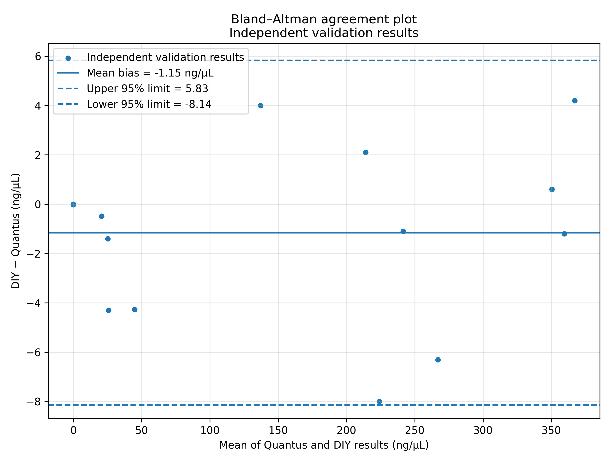
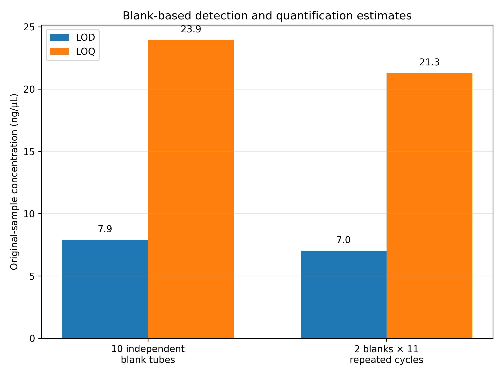

# 10 — Validation and Analytical Performance

> **Operational calibration status:** ACTIVE  
> **Method performance status:** VERIFIED  
> **Operational range:** 0–400 ng/µL dsDNA  
> **Intended use:** Research, teaching, and workshop measurements

## 1. Scope

The DIY fluorometer was evaluated under the final optical configuration and the standard QuantiFluor® ONE workflow of 1 µL sample plus 200 µL reagent.

Routine operation uses a two-point calibration consisting of a reagent blank and a nominal 400 ng/µL lambda-DNA standard. Analytical performance was assessed by comparison with a Promega Quantus Fluorometer, blank measurements, and the three consecutive TSL2591 readings recorded during each measurement cycle.

The Quantus was treated as a commercial comparison instrument rather than as a traceable reference method. It was used as an **independent external comparator**, not as a higher-ranked analytical truth.

## 2. Calibration and comparison design

Two nominal 400 ng/µL lambda-DNA standards were prepared separately:

- one standard for the Quantus calibration;
- one standard for the DIY fluorometer calibration.

The DIY calibration standard returned 395 ng/µL when measured on the Quantus, corresponding to 98.75% recovery. The DIY calibration was not retrospectively changed from 400 to 395 ng/µL.

Fifteen paired values covered the blank-to-upper-standard interval. The 400 ng/µL DIY result is the upper two-point calibration anchor. It is shown in the figures but excluded from the independent linear regression.

## 3. Why the Quantus is not treated as analytically superior

The comparison is arranged with the Quantus concentration on the x-axis only because an external comparator is required to assess the output of the two-point-calibrated DIY instrument.

This does **not** imply that the Quantus is analytically privileged, traceable, or error-free. It simply provides an independent comparison scale. The resulting figures answer the practical question:

> *How closely do the concentrations reported by the two-point-calibrated DIY fluorometer follow an independently measured comparator across the tested range?*

## 4. Linearity of the two-point-calibrated DIY results

The most direct practical linearity check is the comparison of the concentrations reported by the two-point-calibrated DIY fluorometer with the independently obtained Quantus concentrations.

{#fig-ch10-linearity-sd}

For the 14 independent results:

$$
c_{\mathrm{DIY}}=1.0030\,c_{\mathrm{Quantus}} - 1.6373
$$
$$R^2=0.999387$$

The slope was close to 1, the intercept was close to 0, and no systematic curvature was evident over the tested interval.

The same technical-repeat data can also be visualized with 95% confidence intervals for the three technical readings:

{#fig-ch10-linearity-ci}

A formal curvature assessment such as a Mandel fitting test would be more defensible with independent replicate preparations per concentration level. In the present dataset, the triplicate readings are technical sensor repeats rather than independent assay replicates. They support the visual conclusion of linearity and short-term repeatability, but they should not be overinterpreted as full replicate-level evidence of non-linearity testing.

For transparency, including the upper calibration anchor gives:

$$
c_{\mathrm{DIY}}=1.0067\,c_{\mathrm{Quantus}} - 1.9467
$$
$$R^2=0.999415$$

## 5. Agreement with the Quantus

A Bland–Altman plot is a useful complement to the linearity figure because it answers a different question: not *Is the relation linear?*, but *How large is the bias and how wide is the agreement interval between the two devices?*

{#fig-ch10-bland-altman}

The independent comparison results gave:

| Statistic | Result |
|---|---:|
| Independent paired results | 14 |
| Mean bias, DIY − Quantus | -1.15 ng/µL |
| Median bias, DIY − Quantus | -0.79 ng/µL |
| Mean absolute error | 2.71 ng/µL |
| Root mean squared error | 3.62 ng/µL |
| Mean absolute relative difference above the primary LOQ | 3.79% |
| Approximate 95% limits of agreement | -8.14 to 5.83 ng/µL |

The Bland–Altman plot is therefore useful and appropriate here, but as a complement to the linearity assessment rather than a replacement for it.

## 6. What an RFU-versus-calculated-concentration plot can and cannot show

A plot of RFU versus the concentration calculated from the same two-point equation is useful as an **internal arithmetic-consistency check**. In the present device log, the corresponding relationship for rows 11–24 is:

$$
RFU = 102.672895\,c - 0.002265
$$

with: $$R^2 = 0.999999999995$$

This near-perfect linearity is expected because the concentration values are mathematically derived from the same RFU values and the same two-point calibration equation.

Therefore, an RFU-versus-calculated-concentration plot is valuable for checking that the firmware applied the calibration equation correctly, but it is **not independent evidence of analytical linearity**. Independent linearity must instead be judged against an external reference scale or assigned concentration levels.

## 7. Blank performance, LOD, and LOQ

The primary blank study used ten independently prepared reagent-blank tubes. Each tube was measured in one complete cycle of three consecutive sensor readings.

The blank-based evaluation follows the project framework already described in Chapter 3 and uses the practical decision workflow documented here. The reporting of LOD and LOQ is aligned with the analytical concepts underlying **DIN 32645** and the calibration/working-range framework described in **DIN 38402-A51**.

| Primary blank result | Value |
|---|---:|
| Independent blank tubes | 10 |
| Mean VIS signal | 9,557.563 counts |
| SD of blank-cycle means | 126.514 counts |
| LOD, original-sample basis | 7.902 ng/µL |
| LOQ, original-sample basis | 23.946 ng/µL |
| LOD, in-assay basis | 0.03931 ng/µL |
| LOQ, in-assay basis | 0.11913 ng/µL |

Two additional independently prepared blanks were later measured in eleven repeated cycles each. They produced confirmatory estimates of 7.027 ng/µL for the LOD and 21.294 ng/µL for the LOQ. These 22 cycles represent repeated measurements of two blank preparations and are not counted as 22 independent blanks.

{#fig-ch10-blank-limits}

For concise operational use, the project uses approximately:

- **LOD: 8 ng/µL**
- **LOQ: 24 ng/µL**

## 8. Technical repeatability and sensor channels

Every measurement cycle contains three consecutive TSL2591 readings of the same assay tube.

In the final repeated-blank series:

- median within-cycle VIS CV: 0.033%;
- maximum within-cycle VIS CV: 0.348%.

These values demonstrate very good short-term sensor repeatability. They do not represent independent assay-preparation precision.

The analytical signal is calculated as: $$VIS = FULL - IR$$

The IR channel is therefore included in every blank, RFU, and concentration calculation. In the evaluated blank data, IR subtraction slightly reduced rather than increased overall signal variability; the IR channel was not the dominant observed source of variation.

## 9. Operational range and reporting

The operational calibration range is **0–400 ng/µL**. LOD and LOQ define result categories within this range and do not remove the blank endpoint from the stated range.

| Result | Reporting action |
|---|---|
| Blank or below approximately 8 ng/µL | Report as `< LOD` or not detected |
| Approximately 8 to below 24 ng/µL | Report as detected but below LOQ |
| Approximately 24 to 400 ng/µL | Report quantitatively when calibration, blank, and QC requirements pass |
| Above 400 ng/µL or sensor saturation | Dilute the original sample and repeat the assay |

## 10. Routine quality control

Routine measurements continue to use an active two-point calibration. At least one independently prepared control standard should be measured before unknown samples are accepted.

A mid-range control is the most important routine check. Low- and high-level controls can be added where required.

The method-performance status and the current operational-calibration status must remain separate:

```text
Operational calibration status: ACTIVE
Method performance status: VERIFIED
Operational range: 0–400 ng/µL
```

## 11. Conclusion

Under the tested configuration and assay conditions, the DIY fluorometer showed:

- a linear two-point-calibrated response over 0–400 ng/µL;
- close agreement with the Quantus comparison instrument;
- blank-based LOD and LOQ estimates of 7.9 and 23.9 ng/µL;
- very good short-term technical repeatability; and
- valid unsaturated measurements through the 400 ng/µL upper calibration endpoint.

The method is suitable for research, teaching, and workshop measurements. It is not intended for clinical diagnostic use.

## 12. Reproducibility files

The analysis source and data are stored under:

```text
validation/
```

Additional processed data for the technical-triplicate concentration statistics are stored in:

```text
validation/processed_data/diy_triplicate_concentration_summary.csv
```
