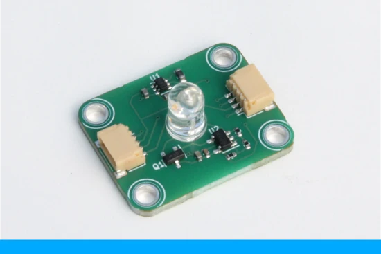

# Upstream source: ioRodeo fixed-current radial LED board

- Project: i-control LED

- Board: Fixed-current radial LED board

- Installed revision: ver_0p1_rev_3

- Repository: https://github.com/iorodeo/i_control_led

- Source format: KiCad

- Licence: CC BY 4.0 (see `license/CC-BY-4.0.txt`)

- Variant: `fixed/5V_regulator/radial_16mA`

- Installed revision: `ver_0p1_rev_3`

- Production path: <https://github.com/iorodeo/i_control_led/tree/main/fixed/5V_regulator/radial_16mA/production/ver_0p1_rev_3>

- License supplied with this package: Creative Commons Attribution 4.0 International

This repository package contains the KiCad schematic and board files, Gerber/drill files, JLCPCB BOM and CPL files.

The radial wavelength-specific LED is installed separately on the back of the board. The board is a fixed-current board and is not an addressable I²C device.
